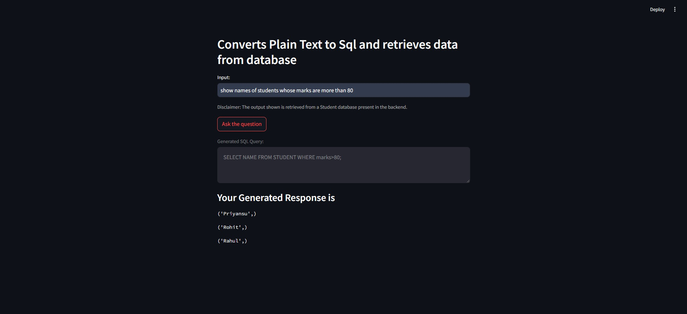

 AI Sql Rule Generator
 • Engineered a tool that translates plain English directives into SQL rules, facilitating streamlined and automated
 data management.
 • Enhanced database efficiency by applying these rules universally, improving data consistency and accessibility.

Implemenation
* Used Sqlite as Database to store student data, which is used to Gemini Pro api to fetch data.
* Used Gemini Pro api to generate sql and output from users given English text.
* Used streamlit to display and deploy the data in the frontend.

Below is the actual implementation

